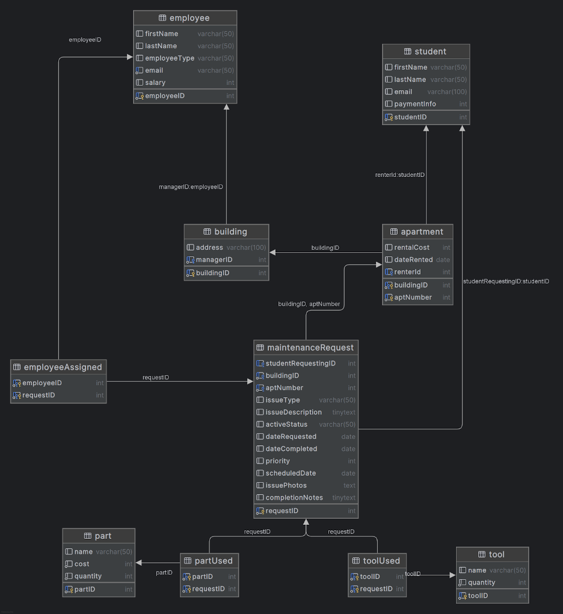

# HuskyFix

A web app to manage housing and maintenance across a large network of buildings. 

## Prerequisites

- A GitHub Account
- A terminal-based git client or GUI Git client such as GitHub Desktop or the Git plugin for VSCode.
- A distribution of Python running on your laptop. The distribution supported by the course is [Anaconda](https://www.anaconda.com/download) or [Miniconda](https://www.anaconda.com/docs/getting-started/miniconda/install).
  - Create a new Python 3.11 environment in `conda` named `db-proj` by running:  
     ```bash
     conda create -n db-proj python=3.11
     ```
  - Install the Python dependencies listed in `api/requirements.txt` and `app/src/requirements.txt` into your local Python environment. You can do this by running `pip install -r requirements.txt` in each respective directory.
     ```bash
     cd api
     pip install -r requirements.txt
     cd ../app
     pip install -r requirements.txt
     ```
     Note that the `..` means go to the parent folder of the folder you're currently in (which is `api/` after the first command)
- VSCode with the Python Plugin installed
  - You may use some other Python/code editor.  However, Course staff will only support VS Code. 

## Running the program

After cloning the repository:
1. Set up the `.env` file in the `api` folder based on the `.env.template` file.
   2. `DB_NAME` should be `husky-fix`
1. For running the testing containers (for your team's repo):
   1. `docker compose up -d` to start all the containers in the background
   1. `docker compose down` to shutdown and delete the containers
   1. `docker compose up db -d` only start the database container (replace db with api or app for the other two services as needed)
   1. `docker compose stop` to "turn off" the containers but not delete them.

**Note:** You can also use the Docker Desktop GUI to start and stop the containers after the first initial run.

### Important Tips

1. In general, any changes you make to the api code base (REST API) or the Streamlit app code should be *hot reloaded* when the files are saved.  This means that the changes should be immediately available.  
   1. Don't forget to hit click the **Always Rerun** button in the browser tab of the Streamlit app for it to reload with changes. 
   1. Sometimes, a bug in the code will shut the containers down.  If this is the case, try and fix the bug in the code.  Then you can restart the `web-app` container in Docker Desktop or restart all the containers with `docker compose restart` (no *-d* flag). 
1. The MySQL Container is different. 
   1. When the MySQL container is ***created*** the first time, it will execute any `.sql` files in the `./database-files` folder. **Important:** it will execute them in alphabetical order.  
   1. The MySQL Container's log files are your friend! Remember, you can access them in Docker Desktop by going to the MySQL Container, and clicking on the `Logs` tab.  If there are errors in your .sql files as it is trying to run them, there will be a message in the logs. You can search 🔍 for `Error` to find them more quickly. 
   1. If you need to update anything in any of your SQL files, you **MUST** recreate the MySQL container (rather than just stopping and restarting it).  You can recreate the MySQL container by using the following command: `docker compose down db -v && docker compose up db -d`. 
      1. `docker compose down db -v` stops and deletes the MySQL container and the volume attached to it. 
      1. `docker compose up db -d` will create a new db container and re-run the files in the `database-files` folder.

## Structure

This application is composed of 3 parts
1. MySQL database
2. Flask API
3. Streamlit UI

##  MySQL Database

The application uses the following database to organize students, employees, and requests


### Notes on the db
* Apartment is a weak entity to building
* Building must be managed by an employee
* Maintenance request must be at an apartment
* All other relations have optional participation

## Flask API

Our web API has 4 main blueprints
* Buildings
* employee
* report
* request

### Buildings

blueprint `/buildings`
* GET `/`
* POST `/`
* PUT `/<int:building_id>`
* GET `/<int:building_id>/apartments`
* PUT `/<int:building_id>/apartments/<int:apt_number>`
* GET `/<int:building_id>/apartments/<int:apt_number>/vacancy`
* GET `/<int:building_id>/apartments/<int:apt_number>/vacancy`

### employee

* GET `''`
* GET `/parts`
* POST `/parts`
* PUT `/parts/<int:part_id>`
* GET `/parts/<int:part_id>`
* PUT `/parts/<int:part_id>/status`
* GET `/reports/monthly-cost`
* GET `/reports/revenue`
* GET `/analytics/avg-requests`
* GET `/analytics/building-comparison`
* 

### report

blueprint `/report`
* GET `/active_requests`
* GET `/AVG_Monthly_Requests`
* GET `/building_request`
* GET `/revenue`
* GET `/cost`
* GET `/vacancies`

### request

* GET `''`
* POST `''`
* GET `/<int:request_id>`
* PUT `/<int:request_id>`
* DELETE `/<int:request_id>`

## StreamlitUI

once the app is running it will be accessible from [This link.](http://0.0.0.0:8501)
From there you'll be able to act as one of our 4 roles
<details>
<summary>Data Analyst</summary>

* View various reports
  * active requests
  * Average monthly requests
  * Requests per building
  * Total revenue
  * Total Cost
  * Vacancies
* Run reports with special parameters
  * specify time frames
  * group stats by categories
</details>
<details>
<summary>Student</summary>

For requests:
* Create
* Manage
* Update
* Review
* Cancel
</details>
<details>
<summary>Maintenance Worker</summary>

* View assigned requests
* Update assigned requests
* Use parts
* Add parts
</details>
<details>
<summary>Landlord</summary>

* Manage requests
  * assign employee
  * update priority
  * cancel
  * complete
* Run cost report
</details>


